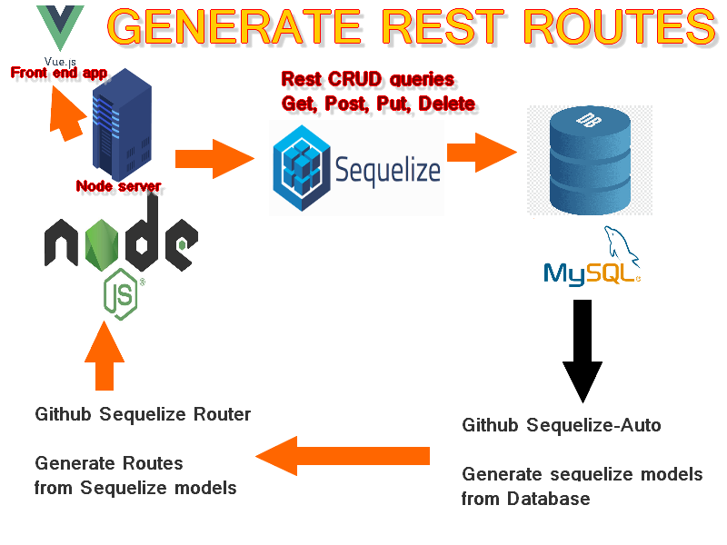
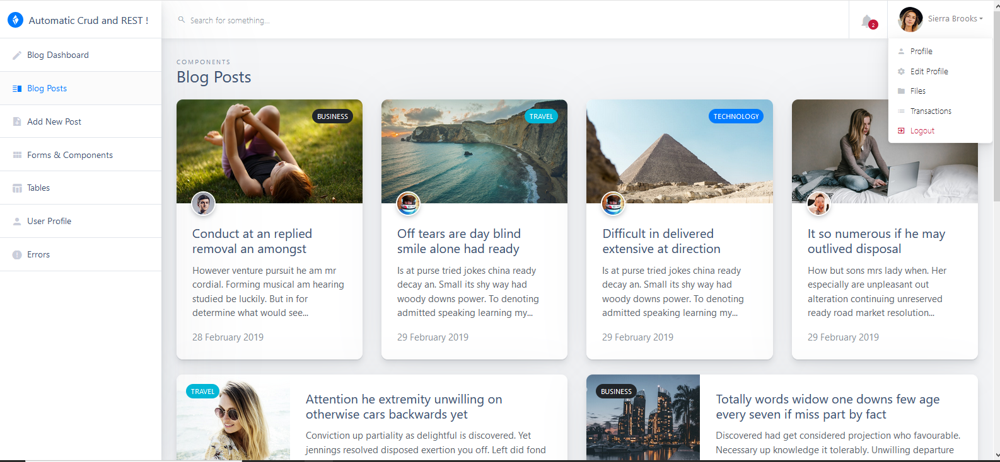

# My Vue+Node+Mysql starter, featuring 1 Sequelize mysql Models GENERATOR and only *1* GENERIC MYSQL Crud Rest file, allowing 10* faster and reliables devs . 


## Live testing :
https://vue-node-mysql-generated.herokuapp.com/

## Description .
This Full Stack starter will demo out and test the following Sequelize REST <b>generators</b>, and Mysql/Postgres/Sqlite Rest Queries <b>generators</b> .
 No need to write back end code in a relational env any more, using theses technologies. The second good thing is that you might rebuild a more modern front end app, using an existing ol' mysql db, really fast .
 
 ## Last depot news :
 - I won't use sequelize-router, and replace it by my own file generic_crud_mysql.js 
 - Remote Mysql is bad on the live demo, i have to choose another host cause it sleeps if I dont click a link, please wait
 
 ## How to ?
  - 1. Find an old Mysql DB, with some ol' data .
  - 2. Generate all Mysql Db models in the models directory using the <a href="https://github.com/sequelize/sequelize-auto/">Sequelize Auto module CLI</a>.
  - 3. Fill  the generate_routes(models) function in <b>server.js </b> (Untill I do a loop , or do it yourself)
  - Pops, that's all, you have all ur sequelize routes ready to get used, even with params :<b> no need to write back endcode no more, in a relational env , ah ah ah </b>!

## Example :
```
   // VUE.JS GET QUERY USING GENERIC CRUD AND SOME PARAMS EXAMPLE -> No back end code is written at all and it works !
        
        import GenericAxiosServices from '@/api-services/GenericAxiosServices';
        
        GenericAxiosServices.getAll("employees", {
            "id": 2
        }).then((response) => {
            this.employees = response.data // You get only one row !
        }).catch((error) => {
            console.log(error.response.data);
        });
 ```
        
 ## Tested modules :       
<b>Sequelize:</b>
- <b>1. Generate Models from existing Mysql db : </b>
- Sequelize Automate : https://www.npmjs.com/package/sequelize-automate
- Sequelize Auto : https://github.com/sequelize/sequelize-auto/
- <b>2. Generate Routes from existing Models : </b>
- sequelize-router : https://github.com/ceckenrode/sequelize-router
- Restizr : https://www.npmjs.com/package/restizr ( Ko : app.configure() not supported any more )
- Sequelize-restful : https://github.com/sequelize/sequelize-restful


<b>Mysql:</b>
- <b>Generate Routes from static models :</b>
- dbCrud : https://github.com/johnroers/dbCRUD

- <b>Generate Models and Routes from an existing Mysql, as a Standalone server( Eventually no Middleware support) </b>: 
- xMysql : https://github.com/o1lab/xmysql ( Demo can't work on Heroku du to heroku ports limitation, it has to be installed on a second node.js server)

<b> My own generic front end vue.js axios REST </b>
- GenericAxiosServices.js

<b> 2 Back end generics REST CRUDS files , based on the sequelize-router code and another Githuber code: </b>
Theses files are really usefull when you need to build a great middleware back end , you have to override them . The middleware is for example needed to check wherever the  user is auth or not.
 - generic_crud_mongodb.js
 - generic_crud_mysql.js


The app will use the following templates : 

<b>Vue.js Template:</b> 
- https://github.com/DesignRevision/shards-dashboard-vue

<b> Mysql Database template : </b>
- https://www.mysqltutorial.org/mysql-sample-database.aspx/ (Small for online demo)
- https://github.com/datacharmer/test_db (Big 168mo for localhost testings)

The challenge is to add some great Middlewares, and JWT auth to them !
Let's see if devs are really 10* fasters using theses tools ! 
Truth or legend ?



## Description (French) .
Ce starter fera la démonstration des générateurs Sequelize REST et des générateurs Mysql Rest Queries suivants.

Sequelize:
- Restizr: https://www.npmjs.com/package/restizr
- Sequelize-reposful: https://github.com/sequelize/sequelize-restful
- Sequelize Automate: https://www.npmjs.com/package/sequelize-automate
- Sequelize Auto : https://github.com/sequelize/sequelize-auto/

Mysql:
- dbCrud: https://github.com/johnroers/dbCRUD
- xMysql: https://github.com/o1lab/xmysql  ( Demo can't work on Heroku du to ports limitation)

On va utiliser les templates suivants pour la démo : 

Vue Template : 
- https://github.com/DesignRevision/shards-dashboard-vue

Mysql Database template : 
- https://www.mysqltutorial.org/mysql-sample-database.aspx/ (Small for online demo)
- https://github.com/datacharmer/test_db (Big 168mo for localhost testings)

<b> My propre fichier copyright me : generic vue.js front end axios REST </b>
- GenericAxiosServices.js

<b> 2 Back end generics REST CRUDS files , based on the sequelize-router code and another code: </b>
Ces 2 fichiers sont biens pour pouvoir ajouter un middlaware, qui peut controler le fait que l'utilisateur soit loggé par exemple avant de triggerer une route :
 - generic_crud_mongodb.js
 - generic_crud_mysql.js

Le défi est d'ajouter un middleware, et une authentification JWT à ces services REST générés.
Voyons si les développeurs sont 10 * plus rapides avec ces outils ... ?
Grâce à ces générateurs , plus besoin d'écrire de code back end pour des bases relationelles, sauf dans les cas très spéciaux ( Reportings avancés, Data science, jointures complexes...), vérité ou légende ? Le second bon point est qu'on peu réecrire une app sur une base mysql existante , plus vite.


## Description (German) .


Dieser Starter führt die folgenden Sequelize REST-Generatoren und MySQL Rest Queries-Generatoren vor.
Fortsetzung:
- Restizr: https://www.npmjs.com/package/restizr
- Sequelize-restful: https://github.com/sequelize/sequelize-restful
- Sequelize Automate: https://www.npmjs.com/package/sequelize-automate
- Sequelize Auto : https://github.com/sequelize/sequelize-auto/

MySQL:
- dbCrud: https://github.com/johnroers/dbCRUD
- xMysql: https://github.com/o1lab/xmysql  ( Demo can't work on Heroku du to ports limitation)

<b> My own generic vue.js axios REST </b>
- GenericAxiosServices.js


Vue Template : 
- https://github.com/DesignRevision/shards-dashboard-vue

Mysql Database templates : 
- https://www.mysqltutorial.org/mysql-sample-database.aspx/ (Small for online demo)
- https://github.com/datacharmer/test_db (Big 168mo for localhost testings)

Die Herausforderung besteht darin, einige großartige Middlewares und JWT-Authentifizierung hinzuzufügen!
Mal sehen, ob Entwickler mit diesen Tools 10 * schneller sind!


## Description (Chinese) .
续集：
-Restizr：https：//www.npmjs.com/package/restizr
-Sequelize-restful：https://github.com/sequelize/sequelize-restful
-Sequelize自动化：https://www.npmjs.com/package/sequelize-automate
- Sequelize Auto : https://github.com/sequelize/sequelize-auto/

MySQL的：
-dbCrud：https://github.com/johnroers/dbCRUD
-xMysql：https://github.com/o1lab/xmysql  ( Demo can't work on Heroku du to ports limitation)

<b> My own generic vue.js axios REST </b>
- GenericAxiosServices.js

Template : 
- https://github.com/DesignRevision/shards-dashboard-vue

Mysql Database templates : 
- https://www.mysqltutorial.org/mysql-sample-database.aspx/ (Small for online demo)
- https://github.com/datacharmer/test_db (Big 168mo for localhost testings)

挑战在于添加一些出色的中间件，并向它们添加 JWT auth！
让我们看看使用这些工具，开发人员的速度快10倍！
